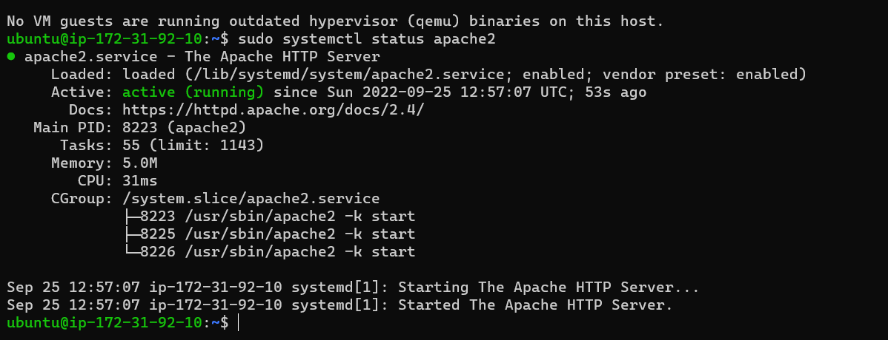

# Awesome Documentation of project 1
## Step 1

`sudo apt update`

`sudo apt install apache2`

`sudo systemctl status apache2`

`curl http://localhost:80`

`curl -s http://169.254.169.254/latest/meta-data/public-ipv4`

`http://<Public-IP-Address>:80`

## Step 2
`sudo apt install mysql-server`

`sudo mysql`

`sudo mysql_secure_installation`

`sudo mysql -p`

`mysql> exit`

## Step 3

`sudo apt install php libapache2-mod-php php-mysql`

`php -v`

## Step 4

`sudo mkdir /var/www/projectlamp`

`sudo chown -R $USER:$USER /var/www/projectlamp`

`sudo vi /etc/apache2/sites-available/projectlamp.conf`

`sudo ls /etc/apache2/sites-available`

`sudo a2ensite projectlamp`

`sudo a2dissite 000-default`

`sudo apache2ctl configtest`

`sudo systemctl reload apache2`

`sudo echo 'Hello LAMP from hostname' $(curl -s http://169.254.169.254/latest/meta-data/public-hostname) 'with public IP' $(curl -s http://169.254.169.254/latest/meta-data/public-ipv4) > /var/www/projectlamp/index.html`

`http://<Public-IP-Address>:80`

`http://<Public-DNS-Name>:80`

## Step 5

`sudo vim /etc/apache2/mods-enabled/dir.conf`

: <IfModule mod_dir.c>
        #Change this:

        #DirectoryIndex index.html index.cgi index.pl index.php index.xhtml index.htm
        #To this:

        DirectoryIndex index.php index.html index.cgi index.pl index.xhtml index.htm
</IfModule>

`sudo systemctl reload apache2`

`vim /var/www/projectlamp/index.php`

> add text:
  *<?php
phpinfo();* 

> When you are finished, save and close the file, refresh the page and you will see a page similar to this

